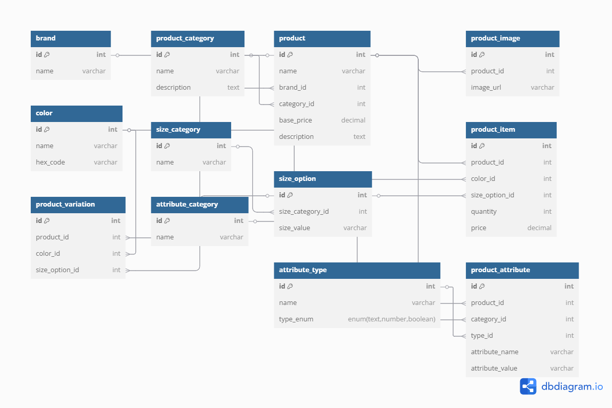

# 🛒 E-commerce Database Design

This project is a collaborative peer group assignment focused on designing a robust database schema for an E-commerce platform. It includes an Entity-Relationship Diagram (ERD) and a complete SQL script for creating the required tables and relationships.

## 📚 Description

The goal of this project is to design and implement a relational database suitable for managing an online store. The database includes support for products, product variations (like size and color), categories, brands, and additional product attributes. The schema is optimized for scalability and normalization.

## 📦 Features

- Support for product images, categories, and brands  
- Product variations (size, color)  
- Flexible attributes (material, weight, etc.)  
- Organized by ERD with clear relationships  

## 🖼️ ERD Diagram

